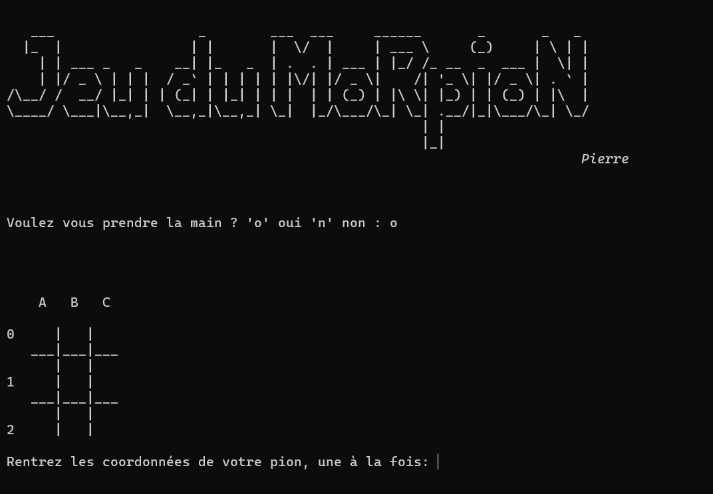
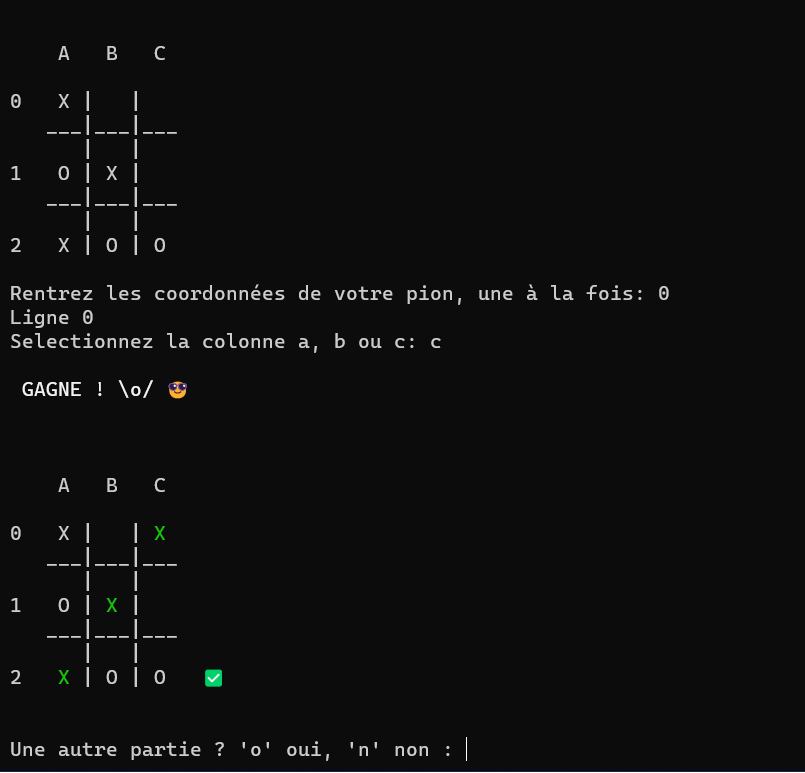
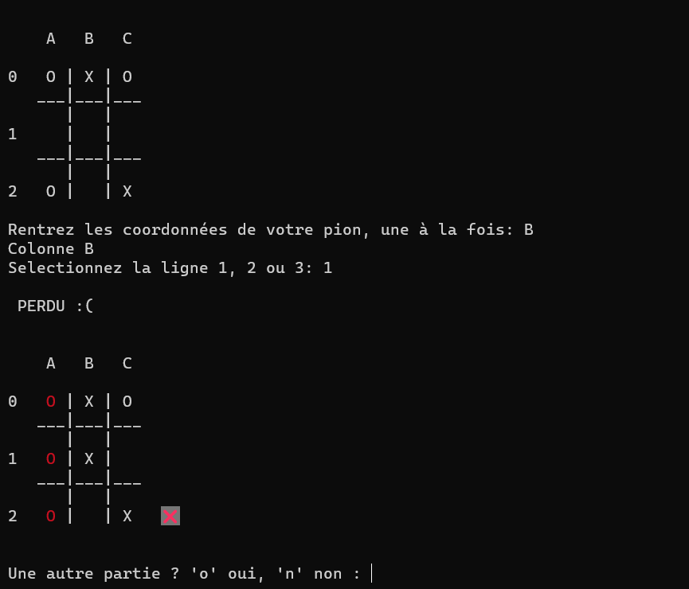

## Jeu du Morpion (Tic Tac Toe)

Projet personnel de développement du jeu du Morpion en langage Python, à lancer sur le terminal.

Challenge : coder un algorythme qui joue les coups d'un joueur adverse.

>Nécéssite Python version 3.10 minimum pour faire fonctionner le module "colorist" qui permet de coloriser le rendu sur le terminal.

>Installez le module "colorist" avec la commande `pip3 install colorist`

Exemples:

